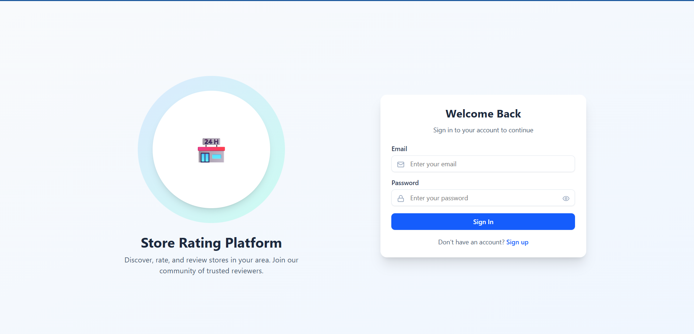
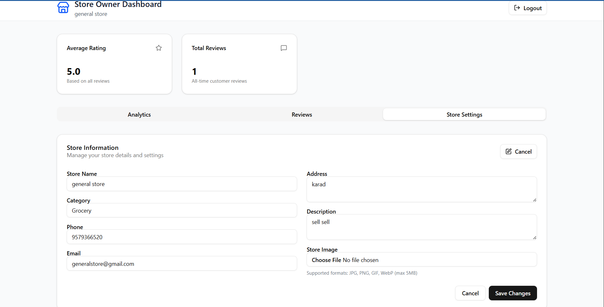
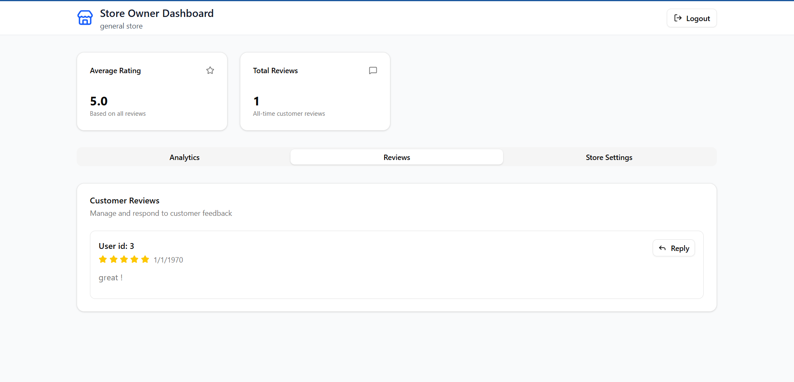
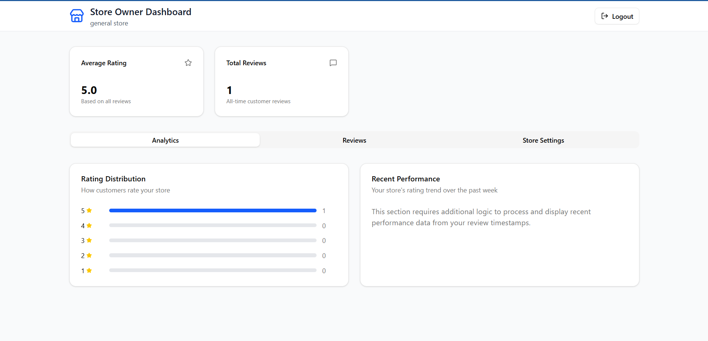
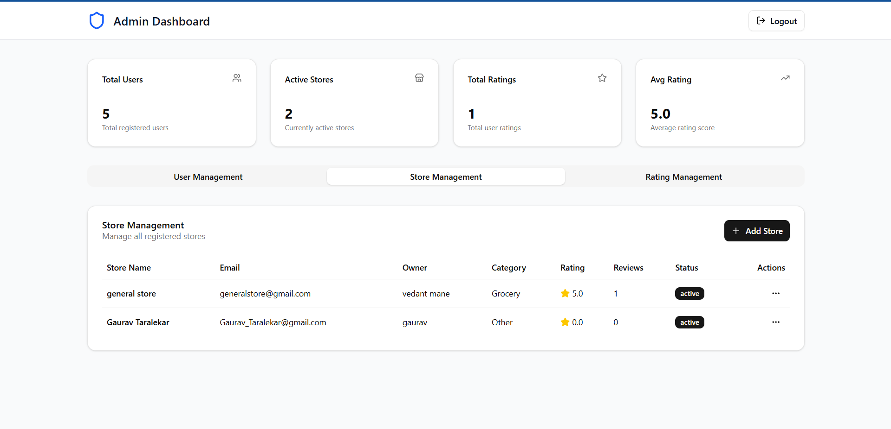
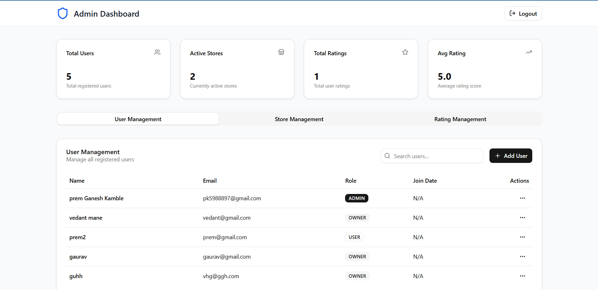
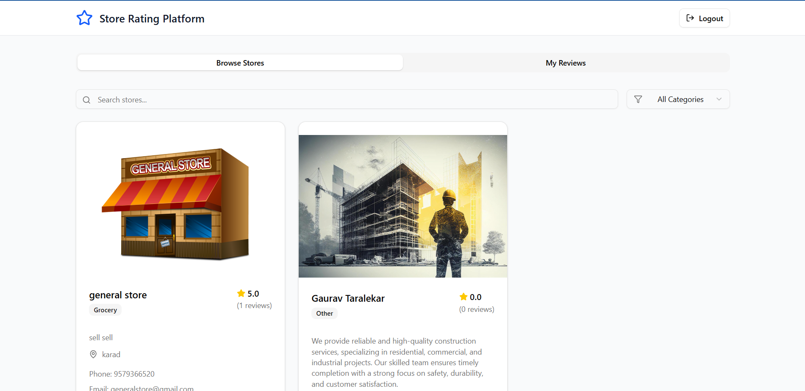

# Store Rating Web App

## Project Description

A full‑stack web application that allows users to submit ratings (1–5) for stores registered on the platform. The app supports three roles: **System Administrator**, **Normal User**, and **Store Owner**, each with role‑based access and dashboards.

---

## Features

* Role based authentication (System Administrator, Normal User, Store Owner)
* Signup / Login flow for Normal Users
* Admin capabilities: add stores & users, dashboards and filtered listings
* Normal User capabilities: browse/search stores, submit/modify ratings
* Store Owner capabilities: view ratings submitted for their store, average rating
* Form validations (Name, Address, Password, Email)
* Tables support sorting and filtering for key fields

---

## Installation Instructions

### Frontend

1. Install dependencies

```bash
npm install
```

2. Start dev server

```bash
npm run dev
```

3. Build the project for production

```bash
npm run build
```

4. Preview the production build

```bash
npm run preview
```

```
```

---

## Usage

* **Normal User**: sign up, log in, search stores, submit/modify ratings.
* **System Administrator**: log in, manage stores and users, view dashboards and listings.
* **Store Owner**: log in, view users who rated their store, check average rating.

Screenshots to demonstrate usage:

`

For example:

* Login Screen
  

* Owner Dashboard
  
  
  

* Admin Dashboard
  
  

* User Dashboard
  


---

##
